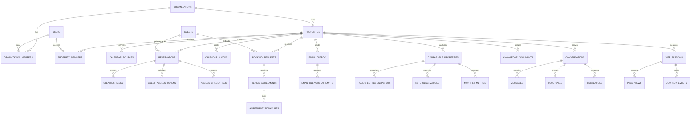

# Entity relationship overview

```mermaid
erDiagram
  ORGANIZATIONS ||--o{ PROPERTIES : owns
  ORGANIZATIONS ||--o{ ORGANIZATION_MEMBERS : has
  USERS ||--o{ ORGANIZATION_MEMBERS : joins
  PROPERTIES ||--o{ PROPERTY_MEMBERS : assigns
  USERS ||--o{ PROPERTY_MEMBERS : receives

  PROPERTIES ||--o{ CALENDAR_SOURCES : connects
  PROPERTIES ||--o{ RESERVATIONS : books
  GUESTS ||--o{ RESERVATIONS : primary_guest
  PROPERTIES ||--o{ CALENDAR_BLOCKS : blocks
  RESERVATIONS ||--o{ CLEANING_TASKS : creates
  RESERVATIONS ||--o{ GUEST_ACCESS_TOKENS : authorizes
  RESERVATIONS ||--o{ ACCESS_CREDENTIALS : protects

  PROPERTIES ||--o{ BOOKING_REQUESTS : receives
  GUESTS ||--o{ BOOKING_REQUESTS : submits
  BOOKING_REQUESTS ||--o{ RENTAL_AGREEMENTS : requires
  RENTAL_AGREEMENTS ||--o{ AGREEMENT_SIGNATURES : signs

  PROPERTIES ||--o{ EMAIL_OUTBOX : sends
  EMAIL_OUTBOX ||--o{ EMAIL_DELIVERY_ATTEMPTS : attempts

  PROPERTIES ||--o{ COMPARABLE_PROPERTIES : analyzes
  COMPARABLE_PROPERTIES ||--o{ PUBLIC_LISTING_SNAPSHOTS : snapshots
  COMPARABLE_PROPERTIES ||--o{ RATE_OBSERVATIONS : observes
  COMPARABLE_PROPERTIES ||--o{ MONTHLY_METRICS : estimates

  PROPERTIES ||--o{ KNOWLEDGE_DOCUMENTS : scopes
  PROPERTIES ||--o{ CONVERSATIONS : serves
  CONVERSATIONS ||--o{ MESSAGES : contains
  CONVERSATIONS ||--o{ TOOL_CALLS : invokes
  CONVERSATIONS ||--o{ ESCALATIONS : escalates

  PROPERTIES ||--o{ WEB_SESSIONS : measures
  WEB_SESSIONS ||--o{ PAGE_VIEWS : contains
  WEB_SESSIONS ||--o{ JOURNEY_EVENTS : tracks
```
